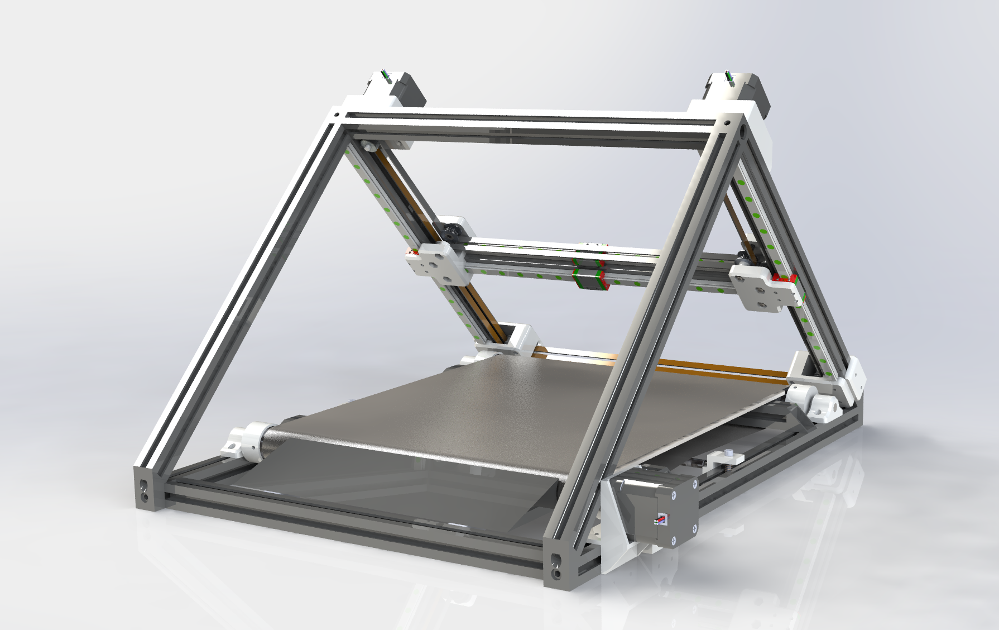

# Belty V1.0
A custom 3D conveyor belt printer with corexy gantry and Spider mainboard using Marlin firmware. 

## Goals
Basic Goal: To learn more about 3D printing and how to design a 3D printer. 
Ultimate Goal: Improve reliability and print quality of belt 3D printers, as well as exploring belt options. 

## To-do
- Solder homing switches (waiting on wires)
- Crimp wires connected to power supply (waiting on crimper)
- Learn Klipper and prepare firmware
- Setup Octoprint with PiCam
- Explore linear/pressure advance and input shaping with belt printer

## Current Issues
- Gt2 belt too loose due to tensioning mechanism, redesign soon
- Extruder motor no movement despite changed Vref
- Y homing and bed leveling with inductive probe
- Possible upgrade to improve conveyor belt tensioning
- Conveyor belt reliability is unknown
- Electronics enclosure redesign needed